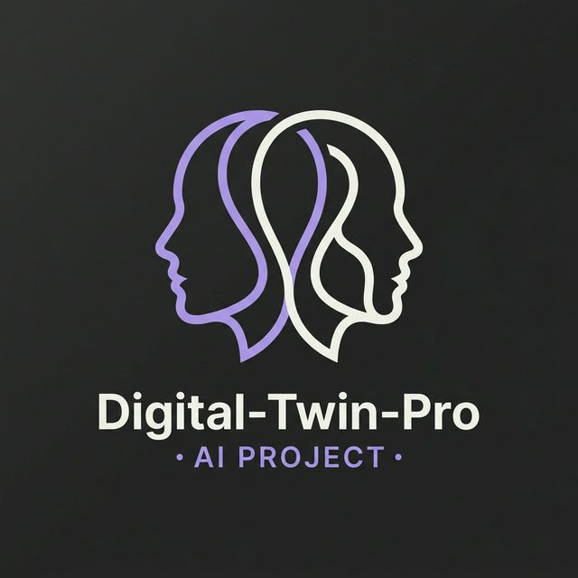

<p align="center">
  
</p>

# 🎭 Digital-Twin-Pro

> **Your Self-Hostable AI Proxy.** Capture your linguistic DNA, voice, and professional style to build an autonomous digital double.

[](https://github.com/RayeesYousufGenAi/digital-twin-pro)
[](https://www.python.org/)
[](https://www.langchain.com/)

---

## 🚀 The Vision

**Digital-Twin-Pro** is an open-source framework designed to empower individuals with their own AI proxy. In an era of AI automation, your "Digital Twin" ensures that the AI version of you maintains your authentic voice, unique phrasing, and professional standards.

### 🧬 Core Pillars
1. **✍️ Style-Mimicry Engine**: Analyzes your past writings (emails, tweets, or blogs) to extract your linguistic DNA—tone, cadence, and vocabulary.
2. **🎙️ Multi-modal Proxy**: Integrated with OpenAI Whisper and TTS for voice-enabled interactions (replies in your tone and style).
3. **🧠 Persistent Memory**: Uses LangChain to store your preferences and professional context for consistent, long-term autonomy.

---

## 🛠️ Technical Implementation

- **Linguistic Analysis**: Employs GPT-4o to perform zero-shot personality profiling from text samples.
- **Context Management**: Utilizes LangChain's memory buffers to maintain a consistent persona throughout a session.
- **UI Architecture**: A high-performance [Streamlit](https://streamlit.io/) dashboard for training and interacting with your twin.

---

## 🚀 Setup & Launch

### 1. Requirements
- **Python**: 3.9+ 
- **OpenAI API Key**: (GPT-4o access required)

### 2. Quick-Start Guide
```bash
git clone https://github.com/RayeesYousufGenAi/digital-twin-pro.git
cd digital-twin-pro
python3 -m venv venv
source venv/bin/activate
pip install -r requirements.txt
```

### 3. Deploy
```bash
streamlit run app.py
```
> [!IMPORTANT]
> **Step 1: Train** your twin by pasting 3-5 high-quality writing samples.
> **Step 2: Proxy** your twin to handle emails, drafts, or social media threads.

---

## 🔒 Privacy & Sovereignty
Digital-Twin-Pro is designed to be **self-hosted**. Your writing samples and style profile reside on your own infrastructure, ensuring you maintain absolute control over your digital identity.

---

## 📄 License
MIT License. Build, clone, and scale.

---

<p align="center">Made with ❤️ by <a href="https://github.com/RayeesYousufGenAi">Rayees Yousuf</a></p>
